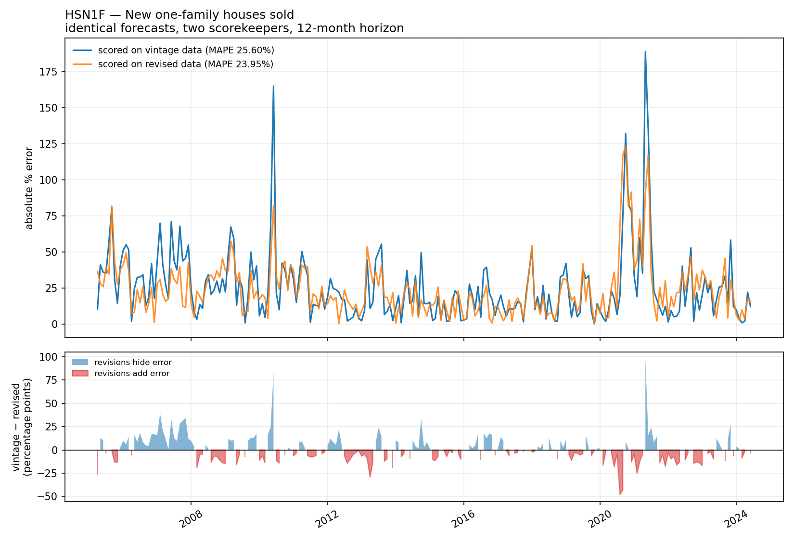

# Housing data: vintages, payloads, and two ways to be quietly wrong

Two small demonstrations on public US housing data, aimed at the same failure mode:
a number that looks right, passes review, and is wrong for a reason nobody checks.

Everything here uses public data. No client data, no employer data.

## 1. Your backtest is probably grading itself on an open book

Housing and economic series get **revised**. Census and BLS restate back-series,
Case-Shiller shifts with seasonal-adjustment updates, MLS-derived figures get amended
weeks later. A backtest that reads today's history table is scoring old forecasts
against numbers that did not exist when those forecasts were made. Revisions leak
backwards, and measured accuracy comes out better than reality. The forecast does not
have to be wrong for the accuracy claim to be wrong.

This repo runs the same naive forecaster over the same origins twice:

- **vintage-correct** — inputs are the series as known on the forecast date, and the
  actual is the value as first published after the target month
- **revised** — inputs and actuals both read today's history, which is the backtest
  almost everyone writes

The gap between the two MAPEs is the size of the self-flattery.

### What I measured

Four US housing series, every vintage FRED has ever published, 12-month horizon,
identical naive model. `leak` is how much of the honest error disappears when you
score against today's revised history instead.

| series | what it is | window | n | vintage MAPE | revised MAPE | leak |
|---|---|---|---|---|---|---|
| CSUSHPINSA | Case-Shiller national HPI | 2015-02 → 2024-06 | 113 | 5.671% | 5.649% | **+0.4%** |
| HOUST | Housing starts | 2005-04 → 2024-06 | 230 | 21.591% | 22.115% | **−2.4%** |
| HSN1F | New one-family homes sold | 2005-04 → 2024-06 | 229 | 25.596% | 23.955% | **+6.4%** |
| PERMIT | Building permits | 2005-04 → 2024-06 | 231 | 19.440% | 19.295% | **+0.7%** |



**The result is not the one I expected, and it is more interesting.** The leak is
real, it is series-dependent, and *it does not have a consistent sign*. New home
sales flatter the naive backtest by 6.4%. Housing starts do the opposite: scoring on
revised data makes the forecast look 2.4% **worse** than it was. Case-Shiller, a
smoothed index, barely moves at 0.4%.

So the takeaway is not "revisions inflate accuracy claims." It is that the effect on
any particular series is unknown until measured, and the aggregate hides a lot:
individual months swing far harder than the averages suggest. On HSN1F the forecast
made in May 2021 scores **188.94% against vintage data and 91.04% against revised
data** — the same forecast graded as roughly twice as wrong depending on which
scorekeeper you use.

Some individual figures move a long way after first publication: housing starts for
January 1960 has been published 791 times and has travelled from 1,366 to 1,684
(+23.3%). New home sales for April 2010 moved +21.7% across 193 vintages.

Full numbers, per-origin worst cases and the most-revised periods:
[`output/results.md`](output/results.md).

### The trap that makes this worth a repo

`https://fred.stlouisfed.org/graph/fredgraph.csv` accepts a `vintage_date` parameter
and **silently ignores it**. Identical bytes back, HTTP 200, no warning. Build your
"vintage-correct" evaluation on that endpoint and you get current data wearing a
vintage label. Real vintages come from the FRED API with `output_type=2`.

## 2. A national ZIP map is not a database query

Measured on Zillow's public ZIP-level ZHVI, not estimated:

| | |
|---|---|
| ZIPs in the file | 26,268 |
| one month, every ZIP, raw float32 | 102.6 KB |
| same, gzip -9 | **90.6 KB** |
| same, uint16 quantised to $1,000 | **37.7 KB** |
| geo-id index, gzipped, fetched once | 58.5 KB |
| 24 months of one metric | 0.88 MB |

Two things fall out of measuring rather than assuming. **float32 barely compresses** —
mantissa bits look like noise to gzip, so you get ~11% off and no more. The win comes
from quantising to the precision the UI actually renders; a choropleth drawn in colour
bands does not need sub-dollar resolution. And at these sizes the whole hot path
belongs on a CDN as static objects, not in an API. Fifty metrics × 24 months × three
geography levels is ~3,600 objects and ~132 MB.

One metric's full history since 2000 is 32 MB as float32. Fifty of them is 1.6 GB.
That is a single-machine problem wearing a big-data costume.

## 3. ZIP is not ZCTA, and neither is a county

Zillow keys home values by USPS ZIP. The Census keys demographics by ZCTA. Counties
are a third geography. Measured against the Census 2020 ZCTA-to-county relationship
file:

| | |
|---|---|
| Zillow ZIPs | 26,268 |
| ZCTAs | 33,791 |
| Zillow ZIPs with no matching ZCTA | **7** (0.03%) |
| ZCTAs straddling a county line | **10,186** (30.1%) |
| most counties one ZCTA touches | 6 |
| ZIPs given the wrong county by a naive first-match join | **4,940** (18.8%) |
| rows: naive join vs land-area allocation | 26,261 vs 37,981 |

I expected rows to disappear. Almost none do — seven. **The damage is
misattribution, not loss.** Nearly a third of ZCTAs cross county lines, so a join
that takes whichever county row it meets first assigns the wrong one to about a fifth
of the file. Nothing raises an error, the row count looks right, and a county-level
rollup built on top is quietly wrong. Allocating by land-area overlap instead turns
26,261 rows into 37,981, because a ZIP that spans three counties genuinely belongs to
three counties.

That is the whole theme of this repo: the dangerous failure is not the one that
throws, it is the one that returns a plausible number.

## Running it

```bash
pip install -r requirements.txt
./run.sh                      # CSUSHPINSA, 2008-2024
./run.sh --series HOUST       # housing starts, revised harder
```

The backtest needs a free FRED API key for the vintage archive
(<https://fredaccount.stlouisfed.org/apikey>, instant). Export `FRED_API_KEY` or drop
it in `.secrets/fred/api_key.txt`. Without a key the script still runs the revised-data
backtest and tells you what it cannot do — which is itself the point.

## Layout

```
src/store.py      bitemporal store: append-only, (period, as_of), never UPDATE
src/fetch.py      FRED current snapshot (no key) + full vintage archive (key)
src/backtest.py   walk-forward forecaster, scored both ways
src/payloads.py   precomputed map payloads + the measurement above
src/crosswalk.py  ZIP / ZCTA / county join, naive vs land-area weighted
main.py           orchestrates, writes output/
```

The store is the interesting part and it is 60 lines. One rule: nothing is updated in
place, so `as_known_on(series, date)` can always answer what you believed on any past
date. "Why did this number change last month?" becomes a query instead of an
investigation.

## Data and attribution

- **Zillow** — ZHVI, ZIP level, from <https://www.zillow.com/research/data/>. Free for
  non-commercial use with attribution; see Zillow's terms of use.
- **FRED / ALFRED**, Federal Reserve Bank of St. Louis — <https://fred.stlouisfed.org>.
- **US Census Bureau** — 2020 ZCTA-to-county relationship file, public domain.

Neither dataset is redistributed here. The scripts download them.

## What this is not

A forecasting model. The forecaster is deliberately trivial so the argument stays
about measurement. Swapping in a good model changes both MAPEs and leaves the gap,
which is the whole point.
